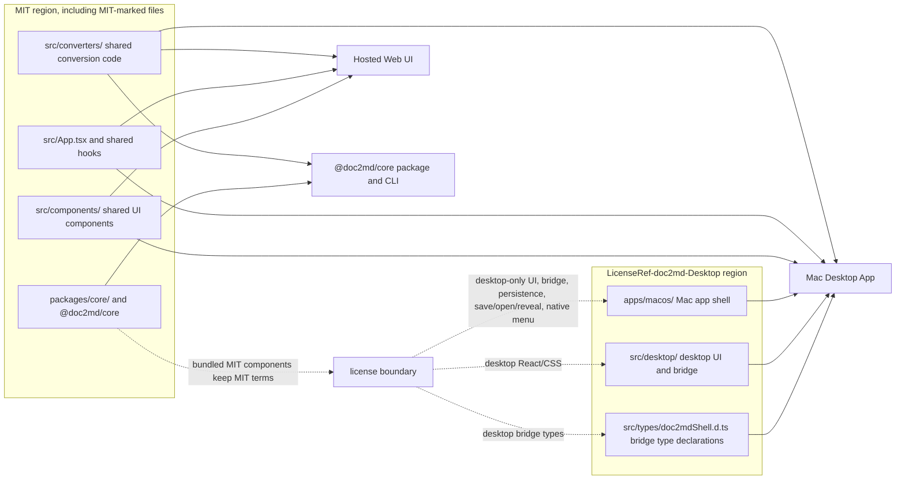

# System Architecture

doc2md converts documents to Markdown through three surfaces: a hosted browser UI, a Mac desktop app, and a Node.js npm package. All three use the shared converter layer, while desktop-only bridge, persistence, menu, save, reveal, and native shell behavior stays in desktop-owned paths.

| Surface | Runtime | Owned paths | Output |
|---|---|---|---|
| Hosted Web UI | React + Vite in the browser | `src/App.tsx`, shared `src/components/`, shared hooks, `src/converters/` | Static site for GitHub Pages |
| Mac Desktop App | Swift `WKWebView` shell plus React desktop root | `apps/macos/`, `src/desktop/`, `src/types/doc2mdShell.d.ts` | Signed/notarized `.app`, DMG, and Sparkle ZIP |
| `@doc2md/core` | Node 22, Vite SSR library build | `packages/core/src/`, shared `src/converters/` | npm tarball and CLI |

`src/converters/` is the shared source of truth for CSV, DOCX, HTML, JSON, Markdown, PDF, PPTX, TSV, TXT, and XLSX conversion. It is imported by all three surfaces.

## License Boundary Diagram



Plain-text view:

```text
+----------------------------------------------+      +----------------------------------------------+
| MIT region, including MIT-marked files       |      | LicenseRef-doc2md-Desktop region            |
|                                              |      |                                              |
| src/converters/: shared conversion code      |      | apps/macos/: Mac app shell                  |
| src/components/: shared UI components        |      | src/desktop/: desktop UI and bridge         |
| src/App.tsx and shared hooks                 |      | src/types/doc2mdShell.d.ts: bridge types    |
| packages/core/, @doc2md/core                 |      |                                              |
+----------------------+-----------------------+      +----------------------+-----------------------+
                    |                                           ^
                    | shared MIT code used by all surfaces      |
                    v                                           |
        consumers of shared MIT code:                    |
        +-----------------------+                        |
        | Hosted Web UI         |                        |
        +-----------------------+                        |
        +-----------------------+                        |
        | @doc2md/core CLI      |                        |
        +-----------------------+                        |
        +-----------------------+           license boundary
        | Mac Desktop App       |<-------------------------+
        +-----------------------+   desktop-only UI, bridge,
                                    persistence, save/open/reveal,
                                    native menu, and CSS
```

## Shared Converter Layer

All document conversion logic lives in `/src/converters/`. The hosted web UI, Mac desktop app, and npm package import from this directory as their single source of truth.

### Supported Formats

| Format | Converter | Key dependency |
|--------|-----------|----------------|
| CSV    | `csv.ts`  | `delimited.ts` (shared table renderer) |
| DOCX   | `docx.ts` | mammoth, turndown |
| HTML   | `html.ts` | turndown, `richText.ts` |
| JSON   | `json.ts` | Built-in |
| MD     | `md.ts`   | Passthrough |
| PDF    | `pdf.ts`  | pdfjs-dist |
| PPTX   | `pptx.ts` | jszip |
| TSV    | `tsv.ts`  | `delimited.ts` |
| TXT    | `txt.ts`  | Built-in |
| XLSX   | `xlsx.ts` | read-excel-file, `office.ts` |

Format dispatch is handled by `index.ts`, which maps each `SupportedFormat` string to its converter function via a `Record<SupportedFormat, Converter>`.

### Utility Modules

| Module | Role |
|--------|------|
| `runtime.ts` | Runtime compatibility bridge (DOMParser resolution) |
| `types.ts` | `ConversionResult` and `Converter` type definitions |
| `messages.ts` | Shared error/warning message constants |
| `delimited.ts` | Shared delimiter-based table parsing and Markdown rendering |
| `office.ts` | Shared helpers for Office formats (mammoth, read-excel-file) |
| `richText.ts` | HTML-to-Markdown conversion via turndown with table handling |
| `readText.ts` | Runtime-aware text file reading (FileReader vs Blob.text()) |
| `readBinary.ts` | Runtime-aware binary file reading (FileReader vs Blob.arrayBuffer()) |

### ConversionResult Contract

Every converter returns `Promise<ConversionResult>`:

```typescript
interface ConversionResult {
  markdown: string;                    // The converted Markdown output
  warnings: string[];                  // Human-readable warnings (empty if clean)
  status: "success" | "warning" | "error";
  quality?: {                          // Optional, used by PDF converter
    level: "good" | "review" | "poor";
    summary: string;
  };
}
```

## Build Targets

### Hosted Web UI (GitHub Pages)

**Build config:** Root `vite.config.ts`

- Vite + React (`@vitejs/plugin-react`)
- Base path: `/doc2md/`
- Produces a static site deployed to GitHub Pages
- Test environment: jsdom (via vitest)

**Data flow:**

1. User drops one or more local files into the React UI, or supplies a direct document URL
2. For remote URLs, the browser fetches the document directly after user confirmation and wraps the document in a `File`
3. The browser selects the matching converter via `convertFile()` in `/src/converters/index.ts`
4. The converter returns a `ConversionResult` with Markdown, warnings, and status
5. The user reviews the result locally and downloads `.md` files

**Hosted/shared code:** React components in `/src/components/`, `src/App.tsx`, shared hooks, and UI state management. This surface must not import `src/desktop/`, `src/types/doc2mdShell.d.ts`, or desktop-only persistence/save/reveal/native-menu behavior.

### Mac Desktop App

**Build config:** Root `vite.config.ts` in desktop mode plus `apps/macos/doc2md.xcodeproj`

- `npm run build:desktop` builds the desktop web bundle from `src/desktop/main.tsx`.
- `npm run build:mac` builds the Release `.app` through the Mac build helper.
- `apps/macos/` owns the Swift shell, `WKWebView`, custom scheme handler, file bridge, persistence store, native menus, Sparkle update plumbing, signing/notarization workflow, app icons, and bundled resources.
- `src/desktop/` owns desktop-only React composition, bridge behavior, native save/open/reveal flows, desktop persistence, native-menu listeners, and desktop CSS.
- `src/types/doc2mdShell.d.ts` describes the injected desktop bridge contract.

**Data flow:**

1. The Swift app loads the desktop Vite bundle into `WKWebView`.
2. `window.doc2mdShell` is injected at document start for desktop file operations.
3. Desktop React code calls the bridge for open, save, save-as, reveal, file metadata, persistence, and native menu events.
4. Conversion still runs through the shared converter layer; Markdown persistence is desktop-owned.

**License boundary:** desktop-specific app code is source-visible shareware under `LicenseRef-doc2md-Desktop`. Shared converters, hosted-web code, `@doc2md/core`, and MIT-marked files remain independently usable under MIT. See `docs/licensing.md`.

### @doc2md/core (npm package)

**Build config:** `packages/core/vite.config.ts`

- Vite SSR lib build (`build.ssr: true`)
- Target: `node22`
- ES module format
- Two entry points: `index.ts` (API) and `cli.ts` (CLI)
- Externals: `node:*` built-in modules
- Output: `packages/core/dist/`

**Programmatic API** (`@doc2md/core`):

```typescript
import { convertDocument, convertDocuments } from "@doc2md/core";

// Single document
const result = await convertDocument("report.pdf", { outputDir: "./out" });

// Batch (with concurrency and limits)
const batch = await convertDocuments(
  ["a.docx", "b.xlsx"],
  { outputDir: "./out", maxDocuments: 50, concurrency: 4 }
);
```

Both functions call `ensureNodeCompat()` before delegating to the shared converter layer.

**CLI** (`doc2md`):

```
doc2md <input...> -o <output-dir> [--max <n>] [--concurrency <n>]
```

**npm-only code in `packages/core/src/`:**

| Module | Role |
|--------|------|
| `index.ts` | Public API surface (`convertDocument`, `convertDocuments`) |
| `cli.ts` | CLI entry point with arg parsing and JSON output |
| `cli-options.ts` | CLI argument parser |
| `batch.ts` | Batch processing with concurrency control |
| `io.ts` | Node file I/O (read files, write Markdown output, MIME mapping) |
| `node-compat.ts` | jsdom DOMParser injection into the runtime bridge |
| `types.ts` | npm-specific types (`ConvertOptions`, `DocumentResult`, `BatchResult`) |

**Cross-package import pattern:** `packages/core/src/batch.ts` imports directly from the root `src/converters/` directory using relative paths that cross the package boundary. The shared converter code is compiled into the npm package at build time by Vite's SSR bundler.

## Runtime Compatibility

The shared converters were originally written for the browser. Several converters use `DOMParser` (via `richText.ts`) and `FileReader` (via `readText.ts` and `readBinary.ts`), which are browser-native APIs not available in Node.

The runtime bridge solves this:

```
Browser path:
  getDomParser() → globalThis.DOMParser (native, always available)

Node path:
  ensureNodeCompat()                         [packages/core/src/node-compat.ts]
    → import("jsdom")
    → new JSDOM("").window.DOMParser
    → enableNodeCompat({ domParser })        [src/converters/runtime.ts]
  getDomParser() → injected jsdom DOMParser
```

**Key design points:**

- `runtime.ts` holds a module-scoped flag and DOMParser reference. It exposes `enableNodeCompat()`, `isNodeCompatEnabled()`, and `getDomParser()`.
- `node-compat.ts` lazily initializes jsdom once (memoized via a shared `Promise`) and injects the DOMParser into the runtime bridge.
- `readText.ts` and `readBinary.ts` check `isNodeCompatEnabled()` to choose between `FileReader` and direct `Blob` methods.
- The bridge is transparent to converter code: converters call `getDomParser()` and `readFileAsText()`/`readFileAsArrayBuffer()` without knowing which runtime they are in.

## Shared vs. Non-Shared Layers

| Layer | Shared | Web-Only | npm-Only |
|-------|--------|----------|----------|
| Converter logic (`/src/converters/`) | Yes | — | — |
| ConversionResult contract | Yes | — | — |
| Runtime bridge (`runtime.ts`) | Yes | — | — |
| React UI (`/src/components/`) | — | Yes | — |
| App entry and state (`/src/App.tsx`) | — | Yes | — |
| CLI and arg parsing | — | — | Yes |
| Batch processing with concurrency | — | — | Yes |
| Node file I/O (`io.ts`) | — | — | Yes |
| jsdom DOMParser shim (`node-compat.ts`) | — | — | Yes |
| npm types (`ConvertOptions`, `BatchResult`) | — | — | Yes |

## Client-Side Stack

The web UI uses these client-side libraries for in-browser document processing:

- **React + TypeScript + Vite** power the static frontend
- **mammoth** reads `.docx` content into semantic HTML for Markdown conversion
- **turndown** converts HTML-based input into Markdown
- **read-excel-file** handles spreadsheet parsing for `.xlsx`
- **pdfjs-dist** extracts selectable text from PDFs via a browser-side worker
- **jszip** supports `.pptx` archive inspection
- **react-markdown + remark-gfm** render the Markdown preview

## Privacy and Local Processing

- **Privacy-forward by default:** local files are processed in-browser, and remote URLs are fetched directly by the browser instead of being uploaded to a doc2md service.
- **Simple trust model:** no server-side storage, queue, or backend worker pipeline.
- **Honest scope:** the web surface is a static frontend utility, not a document-processing platform.
- **Browser URL limits:** direct browser URL fetches use a 30-second download timeout and the existing 50 MiB in-browser size cap before conversion continues.
- **Shared browser URL contract:** remote URL imports use a browser-only fetch path after explicit user confirmation, so the same CORS, timeout, size, and privacy boundaries apply.

The Mac desktop app and npm package follow the same principle at their runtime layer: conversion runs locally, no document data is sent to a doc2md service.

## Limits and Boundaries

- PDF support is best-effort and text-first; scanned or image-based PDFs are out of scope.
- PPTX support is experimental and intentionally conservative.
- Remote URL imports depend on direct browser access. Private endpoints, auth-gated downloads, or origins without suitable cross-origin access may fail before conversion starts.
- Remote URLs are fetched exactly as provided. doc2md does not rewrite provider-specific page URLs into direct-download URLs.
- `@doc2md/core` and the CLI also fetch remote URLs directly, from the local Node process, with a 30-second default timeout and no extra byte-size cap.
- The web UI has no backend API, server-side worker, queue, Redis, auth, telemetry, or server deployment path.
- A browser-side PDF.js worker is used for PDF parsing, but it runs locally in the user's browser and is not a separate service boundary.
- The npm package enforces a configurable batch limit (default 50 documents) via `BatchLimitExceededError`.
- If a server component is ever added, document that contract separately instead of stretching this reference beyond what the repo actually does.

## Deployment

- **Web UI:** Ships as a static Vite build and can be hosted on GitHub Pages or any equivalent static host.
- **Mac desktop app:** Ships as a signed/notarized `.app` and DMG through the protected Mac release workflow. The release runbook lives in `apps/macos/README.md`.
- **npm package:** Published as `@doc2md/core` to the npm registry. Requires Node >= 22. Includes a `bin/doc2md.js` CLI entry point.

## See Also

- [Mac app runbook](../apps/macos/README.md) — local builds, release workflow, Sparkle, signing, and manual validation
- [Licensing guide](licensing.md) — MIT/shareware boundary and contribution expectations
- [Publishing @doc2md/core](publishing-doc2md-core.md) — release process and npm publishing workflow
- [Using @doc2md/core](using-doc2md-core.md) — consumer guide for the npm package API and CLI
